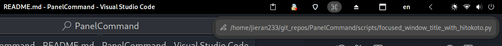

# Panel Command

Add a command output (and a button to set command) to your GNOME panel.

## Usage

Clone this repo

Currently this extension has no settings gui. Except the command, change settings should change source code and rebuild

- The text in button: `text: '⌘',` at line 39 in `extension.js`
- Place of the command output label: `boxes['center'].insert_child_at_index(this.noteInPanel, gravities['center']);` at line 71 in `extension.js`
- Polling interval: `}, 1000);` at line 106 in `extension.js`

Build and install by running `make && make install`

Logout and re-login, then go to extensions to enable this extension

You can click `⌘` button to modify the command

**Warning**: Please note that once you change something, the command is executed immediately, which may lead to dangerous commands being executed incorrectly, so it is recommended to always copy and paste to change the command

To use preset scripts (in `scripts/`), `chmod +x ` it and paste the path to the input box

## Acknowledgments

In building this project, we would like to acknowledge the contributions of the following projects:

- https://github.com/GittyMac/PanelNote
- https://github.com/xelad0m/just-another-search-bar
- https://github.com/fablevi/OnTheTop/blob/main/schemas/org.gnome.shell.extensions.on-the-top.gschema.xml
- https://github.com/corecoding/Vitals/blob/c2348f1da1668bc6cf421b7cf7c73ceb86c1dfdc/extension.js#L300